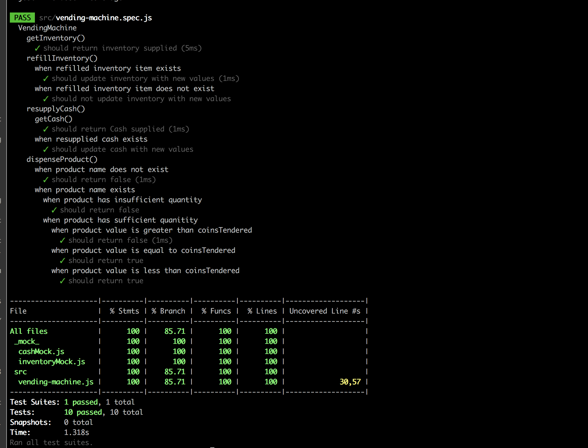

# Vending Machine Code Interview

This Repository implements a vending machine in Javascript.

To run the project:

in the home directory install the modules with:

```
npm install
```

to run the tests:

```
npm test
```

screenshot: 




